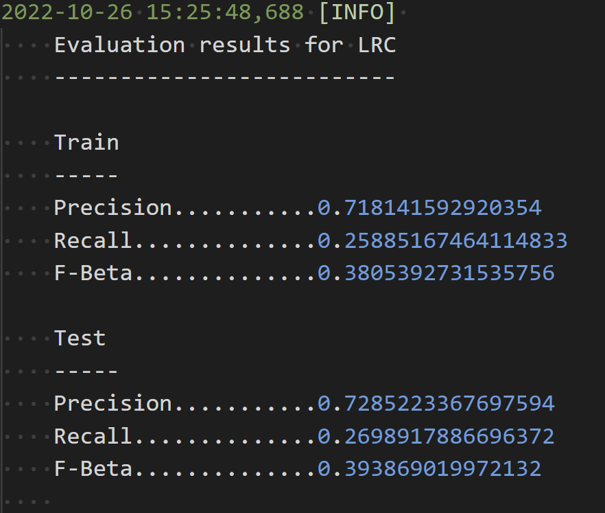

# Model Card
## Model Details
This model uses a logistic regression classifier to predict a binary salary
class based on various categorical features.

The model has been trained with default hyperparamters as per the scikit-learn
documentation: [sklearn.linear_model.LogisticRegression](https://scikit-learn.org/stable/modules/generated/sklearn.linear_model.LogisticRegression.html)

The training code was written by Patrick Schmidt. Note that this code is far
from being sophisticated and just demonstrates the features of DVC and scalable
Machine Learning solutions and no focus was laid upon tuning the model.
## Intended Use
The model is not intended to be used for real-life purposes, instead it is a 
demo model to demonstrate the abilities of various CI/CD and API endpoint
frameworks.

No one should really use this model.
## Training Data
The model was trained on the [Census Income Dataset](https://archive.ics.uci.edu/ml/datasets/census+income).
Further information on the dataset can be retrieved at the aforementioned link.
The training/validation data used to train the classifier makes up 75 percent 
of the total dataset.
## Evaluation Data
Same dataset, but the portion of the evaluation data is 25 percent of the dataset.

Note that as a pre-processing step, the following steps were carried out:
- `sed -i s/ //g census.csv` to remove whitespaces in the data
- The `process_data` function in `ml/data.py` pre-processes the data by
one-hot-encoding the categorical features (to be found under `params.yaml`) and making a binary `0/1` label of the `salary` column, which is the target variable.
## Metrics

## Ethical Considerations
This model has not been properly checked for model bias against certain population groups. Note that the model might have bias for certain features, such as:
- Gender
- Race
- Religion
- Origin

and therefore should not be used to make any decisions that might impact these groups in a negative way.
## Caveats and Recommendations
If you really want to use this model somehow make sure to properly select the hyperparameters as I didn't do any tuning and check for bias after training.
